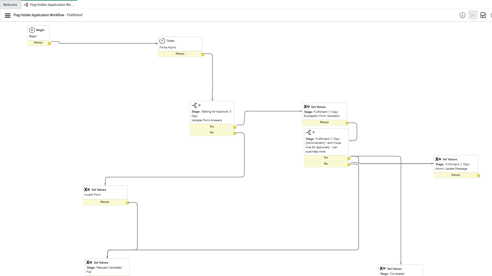

This weekend, ACM Cyber at UC San Diego hosted **SDCTF 2024**, an online CTF competition lasting 48 hours, where players around the world compete to solve challenges and capture flags in the categories: web, pwn, reverse engineering, cryptography, and misc. I was one of the authors for this CTF, and wrote 4 challenges in total. This is the third in a series of three articles covering all 4 challenges. In this post, I will share notes on my explanation, ideas, and solution for the SNOWfall challenge, a web exploitation challenge on the ServiceNow platform involving prototype pollution.

## SNOWfall (1 solve, 500 pts)

### Description

Flag is at https://dev258962.service-now.com/flag, thats it! Oh you might need a special role for it, but I hear its not too hard to request.

### Challenge

We are given a link to a ServiceNow instance, and are told that the flag is at the `/flag` endpoint. We are also told that we might need a special role for it, hinting that the `/flag` endpoint is protected by some sort of role based access control. We are additionally given a `zip` containing `SNOWfall.xml`, which is an "Update Set", similar to a `patch` file that can be applied to a personal ServiceNow instance to recreate the challenge scenario.

### Notes

This challenge is definately a bit different than most web challenges people are used to, even though the core vulnurability is an extremely well known javascript vulnerability that many CTF players are likely familiar with. The challenge runs on a ServiceNow instance, which is a cloud based platform that provides a variety of services, and is also used by UC San Diego themselves for internal document and case management. Since the challenge is a bit different, I will provide a brief overview of the ServiceNow platform, and how the challenge is setup, which hopefully gives a good perspective into what went into this challenge.

At its core, ServiceNow breaks everything down into tables. Everything in ServiceNow is a record in some table, whether it be a user in the `sys_user` table, a catalog item in the `sc_cat_item` table, or an ACL policy in the `sys_security_acl_list`. If we look at the Customer Updates in the `SNOWFall.xml` file, we can see these more clearly:


We can see the "Type" (table) as well as the Record Name for the update. What this update set added overall was the `/flag` page, one Catalog Item called `Flag Holder Application`, and an associated Workflow. From a better UI, the flag holder application looks like this:


We can also see the associated variables for this catalog item on the bottom when we scroll down:


One thing to see here is that there is a `meta` variable thats hidden. This data is populated by an `onSubmit` Catalog Client Script, which is a script that runs when the form is submitted. This script is as follows:

```js
function onSubmit() {
  var meta = {};
  var time = new Date();
  var submitter = g_user.userID;
  var submitterName = g_user.getFullName();

  meta.time = time.toLocaleString();
  meta.submitter = submitter;
  meta.submitterName = submitterName;

  g_form.setValue("meta", JSON.stringify(meta));
}
```

Note here, that this code is run on the server. However note that even though this a hidden field, it is still being submitted from the client, so we can modify it.

Next to notice is the backend, which is the `Flag Holder Application Workflow`.


There are two main issues here, First is in the "Validate Form Answers" If script:

```js
function ifScript() {
  var now = new global.ServiceNowObjectUtils();
  var form_data = {};

  now.merge(form_data, JSON.parse(current.variables.meta));
  now.merge(form_data, current.variables);

  var ritm_data = {};
  now.merge(ritm_data, current);

  gs.info(JSON.stringify(form_data));
  var issues = [];

  if (form_data.submitter != current.opened_by.sys_id) {
    issues.push("You don't seem to be the opener of this case.");
  }

  if (form_data.do_you_want_to_be_a_flag_holder !== "Yes") {
    issues.push("You must want to be a flag holder.");
  }

  var HSLUtils = new global.HSLUtils();
  var colors = form_data.question_color_palette_of_meal.split("|");
  if (colors.length !== 4) {
    issues.push("You must select 4 colors.");
  }

  for (var i = 0; i < colors.length; i++) {
    if (!HSLUtils.test(colors[i])) {
      issues.push("Invalid color: " + colors[i]);
    }
  }

  if (form_data.question_favorite_ice_shape !== "ic_klein_bottle") {
    issues.push("We only like 4D ice here.");
  }

  if (form_data.question_describe_food_taste.length < 30) {
    issues.push("Please describe the taste of food in more detail.");
  }

  if (issues.length > 0) {
    workflow.scratchpad.issue_message = "\n" + issues.join("\n");
    workflow.scratchpad.issue_count = issues.length;
    return false;
  }

  return true;
}

answer = ifScript() ? "yes" : "no";
```

At the top of the script, we call:

```js
var now = new global.ServiceNowObjectUtils();
var form_data = {};

now.merge(form_data, JSON.parse(current.variables.meta));
now.merge(form_data, current.variables);
```

This creates a `ServiceNowObjectUtils` object, which is also present in the Update Set. This is known as a Script Include, which is a reusable script that can be called from other scripts. The `ServiceNowObjectUtils` script include is as follows:

```js
var ServiceNowObjectUtils = Class.create();
ServiceNowObjectUtils.prototype = {
  initialize: function () {},

  merge: function (base, obj) {
    function isObject(obj) {
      return (
        (typeof obj === "object" || typeof obj === "function") &&
        !String(obj.constructor.name).startsWith("Glide")
      );
    }

    for (var key in obj) {
      if (isObject(base[key]) && isObject(obj[key])) {
        this.merge(base[key], obj[key]);
      } else if (key in base) {
        continue;
      } else {
        if (
          obj[key].constructor &&
          obj[key].constructor.name.startsWith("Glide")
        ) {
          base[key] = obj[key].toString();
        } else {
          base[key] = obj[key];
        }
      }
    }
    return base;
  },
  type: "ServiceNowObjectUtils",
};
```

Taking a look at this, one should note that this is a classic case of an unsafe recursive object merge. This is a common vulnerability in javascript, and is known as Prototype Pollution. The `merge` function is recursive, and will merge objects together. However, if the object being merged has a prototype property, it will be copied over to the base object. This can be used to overwrite properties on the base object, and can be used to overwrite properties on the base `{}` object.

The next issue is in the actual `Administrator` script:

```js
var GlideRecordUtil = new global.GlideRecordUtil();
var RoleModUtils = new global.RoleModUtils();

var gr = new GlideRecord("sys_user_has_role");
gr.addQuery("role", "2831a114c611228501d4ea6c309d626d");
gr.query();

do {
  var user_role_obj = {};
  GlideRecordUtil.populateFromGR(user_role_obj, gr);
  if (user_role_obj.user == current.opened_by) {
    RoleModUtils.addRole(current.opened_by, "c60206c2c30602102a53fdec05013190");
    workflow.scratchpad.admin_message = "lgtm, added flag_holder role";
    return true;
  }
} while (gr.next());
```

Its a very subtle issue, but if we look at the `GlideRecord` documentation, we need to actually call `gr.next()` first to get the first record queried. The subtle issue here is that in the first loop iteration, we are going to be referencing an empty object. We can use this to our advantage, combined with the prototype pollution vulnerability.

The solution here is to pass the following from the client as the "meta" variable.

```json
{
  "time": "5/15/2024, 1:54:18 AM",
  "submitter": "--sys-id--",
  "submitterName": "System Administrator",
  "constructor": {
    "prototype": {
      "user": "--sys-id--"
    }
  }
}
```

### Notes

This challenge ended up being much harder than expected, with only 1 solve. This was my mistake, I should have definately provided more information about the ServiceNow platform from the start as well are various references as to how to access records in the platform.

The one team who solved it, `000`, seemed to solve it in this general pattern as well, by starting off noticing the unsafe merge merge code in `ServiceNowObjectUtils`, and then noticing that the `populateFromGR` record was returning an empty object for the record. Its definately extremely extremely hard to solve this without setting up your own PDI, so I should have provided more information on how to do this as well.

But overall this was extremely impressive by `000`, and I had seen a few other challengers get extremely close as well.

Another thing that did trip some users who got this far up, is that the ServiceNow server is running on Rhino1.7R5. People who tried to do prototype pollution using `__proto__` had quit early when it didn't work, but this was due to this Javascript runtime not supporting `__proto__`. There were people who were soooooo close, but got stuck here. I hope people learned alot though about this platform, and it was hopefully a good (maybe just interesting) change of pace :).

### References

- https://developer.servicenow.com/dev.do#!/learn/learning-plans/utah/new_to_servicenow/app_store_learnv2_buildmyfirstapp_utah_personal_developer_instances
- https://docs.servicenow.com/bundle/utah-it-service-management/page/product/site-reliability-ops/task/sro-update-set-quick-start.html
- https://developer.servicenow.com/blog.do?p=/post/training-scriptsbg/
